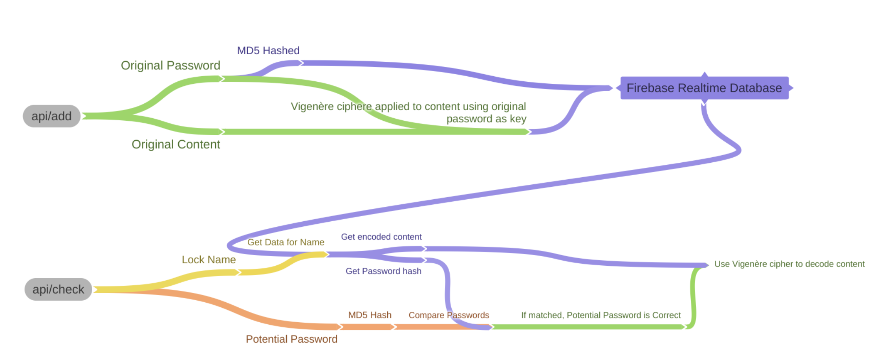

# Simple Website Lock
Creates a very simple, embeddable, password protected lock to hide a small amount of content, ideal for digital breakouts in the classroom. Made with Flask, Firebase Realtime Database, and Bulma. Deployed on Google Cloud App Engine.

**This tool is not secure enough to be used in any security-focused setting. Use with caution.** 

## How it works

### Storing your data
The password that you enter is used to encode your hidden content using a Vigenère cipher, which should not be used for any security applications. However, for short messages it is virtually unbreakable. The password is then hashed using MD5, and stored with the enoded content in the database.

### Checking password
The user's password attempt is hashed and checked against the hashed password stored in the database. If they match, then the user's attempt is valid, and therefore can be used to decode the content (using the Vigenère cipher).

## Routes
### GET ```/```
Website homepage
### GET ```/embed```
Embeddable website link for a specified name
#### URL Params
- ```name``` - *Required*, Name of lock 
- ```background``` - Background color, accepts any valid CSS color
- ```box``` - If true, shows box background 
- ```header``` - Header text. If blank, header is hidden
### GET ```/api/check```
Used to check if password is correct. Return ```"false"``` if not correct, returns success message if correct.
#### URL Params
- ```name``` - *Required*, Name of lock 
- ```password``` - *Required*, Password attempt
### POST ```/api/add```
Adds POSTed data object to realtime database. Must have ```password``` and ```success``` key in the object.
## Funding
If this tool has helped you, consider buying me a coffee.

[](https://ko-fi.com/L4L81FX1O)